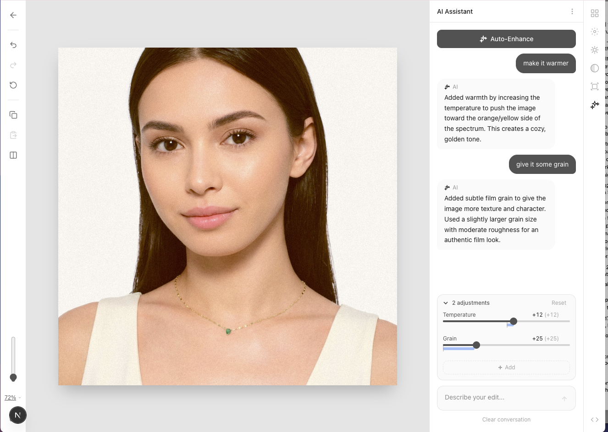

# Lumen

A professional-grade photo editor with AI-powered editing and image generation, built entirely in the browser.



## Features

### Photo Editing
- **Basic Adjustments** - Exposure, contrast, highlights, shadows, whites, blacks
- **White Balance** - Temperature and tint controls
- **Presence** - Clarity, texture, dehaze, vibrance, saturation
- **Tone Curves** - RGB + individual channel curves with point-based editor
- **HSL** - Per-color hue, saturation, and luminance (8 color ranges)
- **Effects** - Grain, vignette, bloom, halation, fade, blur, borders
- **Color Grading** - Split toning, 3-way color wheels, camera calibration
- **Detail** - Sharpening, noise reduction, chromatic aberration removal
- **Transform** - Crop, rotate, straighten, perspective correction, flip
- **Local Adjustments** - Brush, radial, and linear gradient masks

### AI-Powered
- **Natural Language Editing** - Describe edits like "make it warmer" or "film look"
- **Auto-Enhance** - One-click intelligent optimization
- **Image Generation** - Create images from text prompts using Flux models
- **Contextual Chat** - Multi-turn conversations with edit history

### Workflow
- **Gallery** - Masonry grid with real-time edit previews
- **Presets** - Built-in film looks (Portra, Kodak Gold, Fuji) + custom presets
- **History** - 50-level undo/redo
- **Export** - Print-quality output with sRGB ICC profiles (JPEG, PNG, TIFF)
- **Offline-First** - All data stored locally in IndexedDB

## Tech Stack

| Layer | Technology |
|-------|------------|
| Framework | Next.js 16 |
| UI | React 19, Radix UI, Tailwind CSS v4 |
| Rendering | WebGL2 (custom GLSL shaders) |
| State | Zustand |
| AI | Anthropic Claude, Fal.ai Flux |
| Image Processing | Sharp (server-side export) |
| Storage | IndexedDB |

## Getting Started

### Prerequisites

- Node.js 18+
- npm or pnpm

### Installation

```bash
git clone https://github.com/mindswim/lumen.git
cd lumen
npm install
```

### Environment Variables

Create a `.env.local` file (or export in your shell):

```bash
ANTHROPIC_API_KEY=your_anthropic_key
FAL_KEY=your_fal_key
```

| Variable | Required | Description |
|----------|----------|-------------|
| `ANTHROPIC_API_KEY` | Yes (for AI features) | Get from [console.anthropic.com](https://console.anthropic.com) |
| `FAL_KEY` | Yes (for image generation) | Get from [fal.ai](https://fal.ai) |

> Note: The app works without API keys, but AI editing and image generation will be unavailable.

### Run Development Server

```bash
npm run dev
```

Open [http://localhost:3000](http://localhost:3000)

### Build for Production

```bash
npm run build
npm start
```

## Project Structure

```
src/
├── app/                    # Next.js app router
│   ├── api/               # API routes (AI, export)
│   ├── editor/            # Editor page
│   └── page.tsx           # Gallery home
├── components/
│   ├── editor/            # Editor UI panels
│   ├── gallery/           # Gallery components
│   └── ui/                # Shared UI components
├── lib/
│   ├── ai/                # Claude + Fal integrations
│   ├── editor/            # State, presets
│   ├── gallery/           # Gallery store
│   ├── webgl/             # Rendering engine
│   └── storage/           # IndexedDB persistence
└── types/                 # TypeScript definitions
```

## Roadmap

### Working Now
- [x] Full parametric editing (40+ adjustments)
- [x] Real-time WebGL rendering
- [x] AI natural language editing
- [x] AI image generation (Flux)
- [x] Gallery with persistence
- [x] Print-quality export
- [x] Presets system
- [x] Undo/redo history
- [x] Dark/light mode

### Planned
- [ ] Cloud sync with Supabase (auth, storage, sync)
- [ ] Blob storage migration (25% space savings)
- [ ] RAW file support
- [ ] Background replacement (SAM + inpainting)
- [ ] Layer system for compositing

## Browser Support

Requires WebGL2. Works on:
- Chrome 56+
- Firefox 51+
- Safari 15+
- Edge 79+

## License

MIT License - see [LICENSE](LICENSE)

## Acknowledgments

- Inspired by Lightroom, VSCO, and Darkroom
- AI editing powered by [Anthropic Claude](https://anthropic.com)
- Image generation by [Fal.ai](https://fal.ai) Flux models
